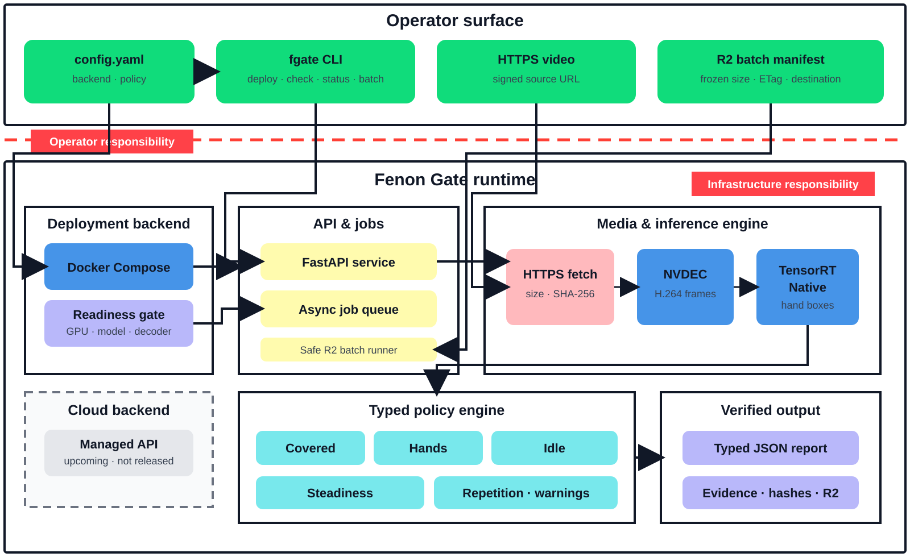

<h1 align="center">Fenon Gate</h1>

<p align="center">
  A reproducible, GPU-native quality gate for first-person video.
</p>

<p align="center">
  
  
  
  
</p>

<p align="center">
  <a href="#news">News</a> ·
  <a href="#features">Features</a> ·
  <a href="#quickstart">Quickstart</a> ·
  <a href="#examples">Examples</a> ·
  <a href="#qc-contract">QC contract</a> ·
  <a href="#project-status">Status</a>
</p>

Fenon Gate turns signed HTTPS or immutable R2 video inputs into typed QC
reports and hash-verified evidence. Operators choose only a backend and policy.
Model paths, TensorRT, NVDEC, and GPU selection stay in
[Docker Compose](docker-compose.yaml).

> [!IMPORTANT]
> The local Docker Compose backend is implemented and validated on an NVIDIA
> A10. Managed cloud is upcoming and is not a released production feature.

<p align="center">
  
</p>

## News

- **2026-09-15 — A10 canary passed.** The HTTPS → NVDEC → TensorRTNative →
  policy → evidence path completed on Lambda Cloud without CPU or inference
  fallback. [See the canary record](docs/canaries/fgate-a10-canary-20260915.md).
- **2026-09 — Local preview available.** The `fgate` CLI, asynchronous API,
  minimal YAML configuration, versioned standard policy, and safe R2 batch
  lifecycle are implemented in the working tree.

## Features

- **One small config.** Select `local` or `cloud` and a named policy.
- **GPU-only production path.** Readiness requires TensorRTNative, NVDEC, the
  selected GPU, and the exact model.
- **Typed QC checks.** Every check returns structured measurements, limits,
  outcomes, and applicable temporal intervals.
- **Verified evidence.** Evidence is checked by byte size and SHA-256 before it
  is accepted locally or remotely.
- **Safe batch processing.** R2 sources are immutable, destinations are
  create-only, and local media is cleaned only after verified upload.
- **No hidden fallback.** A missing model, provider, decoder, or runtime fails
  readiness instead of changing execution semantics.

## Quickstart

### Requirements

- Python 3.12 or newer and [`uv`](https://docs.astral.sh/uv/)
- Docker with Compose
- NVIDIA driver and Container Toolkit
- FFmpeg with `h264_cuvid` and a matching `libnvcuvid.so.1`
- approved dynamic hand model at the path mounted by
  [docker-compose.yaml](docker-compose.yaml)

Install the CLI:

```bash
uv venv --python 3.12 .venv
uv pip install -e '.[dev,cpu]'
source .venv/bin/activate
```

The complete local configuration is:

```yaml
version: 1
backend: local
policy: standard
```

Start the API on the selected GPU:

```bash
export FGATE_GPU_DEVICE=0
fgate deploy config.yaml
```

Deployment succeeds only after the API reports the expected GPU, model,
TensorRTNative provider, NVDEC backend, and policy hashes.

## Examples

### Check one video

```bash
fgate check config.yaml 'https://example.com/presigned-video.mp4'
```

The command waits for completion, writes
`fgate-results/<job-id>/report.json`, downloads the evidence images, and
verifies every artifact.

### Check several videos

```bash
fgate check config.yaml \
  'https://example.com/shift-a.mp4' \
  'https://example.com/shift-b.mp4'
```

### Inspect a job

```bash
fgate status config.yaml JOB_ID
```

### Process an R2 batch

```bash
fgate batch config.yaml examples/job.example.json
```

The [example manifest](examples/job.example.json) freezes every source size and
ETag and defines a create-only result destination.

### Stop the local backend

```bash
fgate undeploy config.yaml
```

## QC contract

The versioned contract lives in
[policies/standard.yaml](policies/standard.yaml):

| Signal | Standard limit | Result |
| --- | ---: | --- |
| Camera covered | Reject after 5 seconds | Hard check |
| Hands visible | At least 60% | Hard check |
| Worker idle | At most 50% in segments ≥10 seconds | Hard check |
| Camera translation | At most 3% | Hard check |
| Camera rotation | At most 5°/s | Hard check |
| Repetitive motion | Score at most 0.85 | Hard check |
| Blur | At most 20% | Warning |
| Bad exposure | At most 20% | Warning |

Covered footage makes hands, idle, repetition, blur, and exposure
`not_applicable`. When hands do not pass, idle and repetition also become
`not_applicable`. This prevents downstream conclusions from unreliable input.

### Report shape

Reports use the `fgate-report-v1` schema and record the policy, model, provider,
GPU, and video backend identities used for the run.

```json
{
  "schema_version": "fgate-report-v1",
  "status": "complete",
  "human_calibrated": false,
  "conditional_on_model": true,
  "results": [
    {
      "verdict": "good",
      "checks": [{"name": "hands_visible", "outcome": "pass"}],
      "warnings": []
    }
  ]
}
```

The automated interval describes temporal sampling uncertainty conditional on
the detector and sampled timeline. It is not a human-validated accuracy or
confidence claim.

## Local and cloud

| Backend | State | Contract |
| --- | --- | --- |
| `local` | **Working; A10 validated** | CLI → Docker Compose → local API |
| `cloud` | **Upcoming; not released** | CLI → authenticated HTTPS API |

The cloud client contract reserves an endpoint and `FGATE_API_TOKEN`, but the
managed API, ingress, model publication, and production rollout gates are not
complete.

## Project status

| Capability | Status |
| --- | --- |
| Local Compose backend | **Available** |
| Async API and CLI | **Available** |
| Standard YAML policy | **Available** |
| Immutable R2 workflow | **Available** |
| NVIDIA A10 provider parity | **Validated** |
| Human-labelled policy calibration | **Blocked on ground truth** |
| Immutable production image and model publication | **Next** |
| Managed cloud backend | **Upcoming** |

The A10 canary matched eight hand-positive frames between static TensorRT and
TensorRTNative with minimum IoU `0.997603` and maximum confidence delta
`0.002270`. That is an execution and provider-parity result, not
human-validated detector accuracy or a production SLA.

See [TASKS.md](TASKS.md) for concrete work, owners, dependencies, and acceptance
criteria. See [RUNBOOK.md](RUNBOOK.md) for deployment and GPU acceptance.

## Development

```bash
make verify
docker compose -f docker-compose.yaml config --quiet
```

`make verify` runs formatting checks, Ruff, strict mypy, and the test suite.
GPU, model, CUDA, TensorRT, or decoder changes also require the canary and
provider-parity checks in the runbook.

## Design principles

- **Minimal operator configuration:** backend and policy in YAML; GPU and model
  mechanics in Compose.
- **Explicit failure:** readiness fails instead of silently degrading.
- **Evidence before cleanup:** outputs are verified before local media is
  released.
- **Immutable identity:** frozen manifests, source ETags, and create-only
  destinations keep reruns auditable.
- **Honest uncertainty:** sampling intervals are never presented as
  human-validated confidence.
